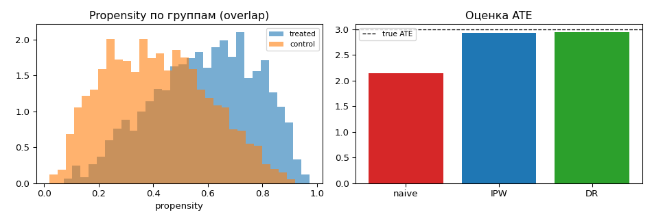
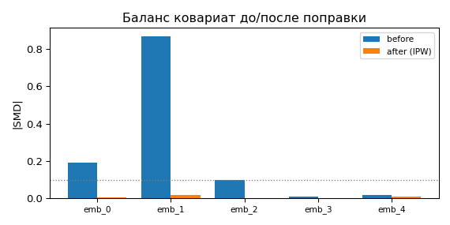

# R&D-7. Эмбеддинги как adjustment set в нерандомизированном испытании

> Статус: 🔶 базовый эксперимент готов. Реализованы тулкит-функции (pyspark) **и** causal-слой
> (numpy/sklearn): оценка ATE с поправкой, диагностика баланса/overlap. Источник чисел —
> `notebook.ipynb` (синтетика, seed=11).

## Цель

Проверить, могут ли клиентские эмбеддинги (в сокращённом виде) выступать как хотя бы
сколько-то хороший **adjustment set** в НЕрандомизированном испытании — то есть
обеспечивать достаточный контроль смещения отбора при оценке причинного эффекта
без рандомизации назначения воздействия.

## Данные

Исходный pyspark-датасет эмбеддингов имеет схему:

```
epk_id, report_dt (месячная гранулярность), emb_0_val, emb_1_val, ..., emb_n_val
```

Поддерживается и легаси-формат `col_000, col_001, ...` (старая витрина) — детектор колонок
распознаёт оба. Назначение воздействия — **опциональная колонка `treatment`** того же
датафрейма (отдельной таблицы трита нет): если её нет, p-score синтезирует случайный трит
(`random_state`).

## Тулкит-функции (готово)

Реализованы в пакете `src/rnd_reports/embeddings/`. Каждая принимает один pyspark `DataFrame`
и возвращает его же с **добавленными** колонками (все исходные сохраняются):

1. **`reduce_embeddings(df, red_size=5)`** (`reducer.py`) — снижает размерность эмбеддингов
   методом **StandardScaler + PCA** (`pyspark.ml`; стандартизация перед PCA обязательна — он
   чувствителен к масштабу признаков) и добавляет колонки `red_0, ..., red_{red_size-1}`.
   PCA детерминирован (SVD) — сид не нужен.
2. **`add_propensity_score(df, ...)`** (`propensity.py`) — сводит эмбеддинги к единственному
   `prop_score = P(treatment=1)` и добавляет его. Трит берётся из колонки `treatment`; если
   её нет — генерируется случайно (`Bernoulli(treatment_share)` с `random_state`) и тоже
   добавляется. Из **LogisticRegression** и **GBTClassifier** берётся модель с лучшим ROC-AUC
   на отложенной выборке. **ROC-AUC — лишь selection-эвристика выбора модели**, а не мера
   качества propensity для causal-задачи: высокий AUC означает почти детерминированный трит и
   тянет за собой плохой overlap и экстремальные веса. Финальный causal-критерий — баланс
   ковариат (`|SMD|`) и overlap/positivity **после** matching/IPW (см. causal-слой ниже).

Контракты схем и валидация — `contracts.py`; конфиг — `configs/07_embedding_adjustment_set/adapters.yaml`.

## Causal-слой (реализован)

`src/rnd_reports/embeddings/experiment.py` (numpy/sklearn, без pyspark — запускается в base-окружении):

- `estimate_ate_with_adjustment(method=…)` — ATE наблюдательных данных: `naive` (разность средних),
  `propensity_weighting` (стабилизированный IPW, propensity = `LogisticRegression` на эмбеддингах),
  `doubly_robust` (AIPW: per-arm регрессия исхода + IPW-коррекция);
- `covariate_balance_after_adjustment` — `|SMD|` ковариат до/после IPW-взвешивания;
- `overlap_diagnostics` — overlap/positivity по распределению propensity;
- `evaluate_adjustment_set_quality` — сводка: ATE тремя методами + смещения vs эталон.

Синтетика — `embeddings/synthetic.py` (`make_embedding_observational_scenario`): латентные
конфаундеры → эмбеддинги `col_*`; `treatment ~ Bernoulli(sigmoid(confounding·z·a))` (селекция,
не рандом); `outcome = true_ate·T + z·b + ε`. ATE известен по построению.

## Результаты

Синтетика n=4000, k=8 эмбеддингов → 5 PCA-компонент как adjustment set, истинный ATE = 3.0, seed=11.

| метод | ATE | смещение vs true | снижение |SMD|/смещения |
| --- | --- | --- | --- |
| naive (без поправки) | 2.145 | −0.855 | — |
| IPW (propensity на эмбеддингах) | 2.930 | −0.070 | **−91.8%** смещения |
| doubly_robust (AIPW) | 2.948 | −0.052 | **−94.0%** смещения |

Баланс ковариат: max `|SMD|` **0.869 → 0.019** после IPW-взвешивания. Overlap: **97.6%** propensity
в [0.1, 0.9] (positivity выполняется).





## Выводы

- Наивная разность средних **смещена** из-за селекции (трит коррелирует с конфаундерами через эмбеддинги).
- Сокращённые эмбеддинги как **adjustment set** + IPW/doubly-robust убирают **~92–94% смещения** и
  восстанавливают баланс ковариат (max `|SMD|` → ~0.02) при хорошем overlap.
- Вывод: клиентские эмбеддинги несут достаточно информации о конфаундерах, чтобы служить
  практичным adjustment set в наблюдательном испытании — **при условии overlap/positivity**.
- Ограничения: результат на синтетике с известным ATE; на реальных данных нужны проверка overlap и
  sensitivity к неучтённым конфаундерам (unconfoundedness напрямую не тестируема). Production-путь —
  pyspark-функции `reduce_embeddings`/`add_propensity_score` (каждая добавляет свои колонки к датафрейму).

## Воспроизведение
```bash
pip install -e .            # base (numpy/pandas/scipy/sklearn) — эксперимент запускается без pyspark
pip install -e .[spark]     # опц.: pyspark для production-адаптеров и их тестов
python tools/execute_notebooks.py   # выполнить notebook.ipynb (→ results/07.../figures/)
python tools/generate_pdf.py        # пересобрать report.pdf
```
