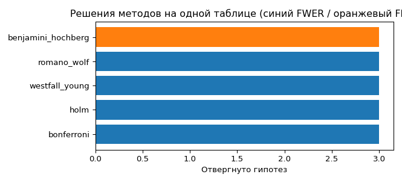
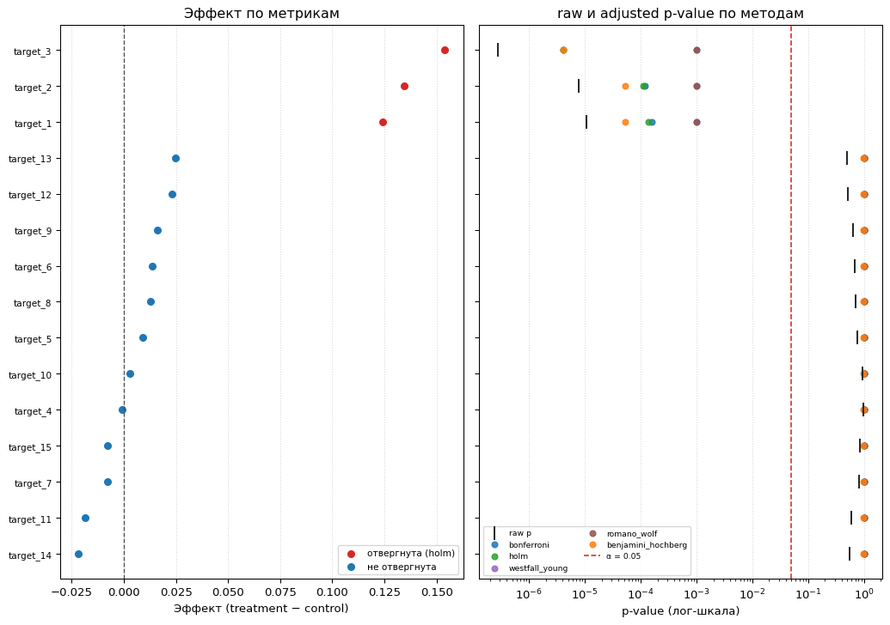
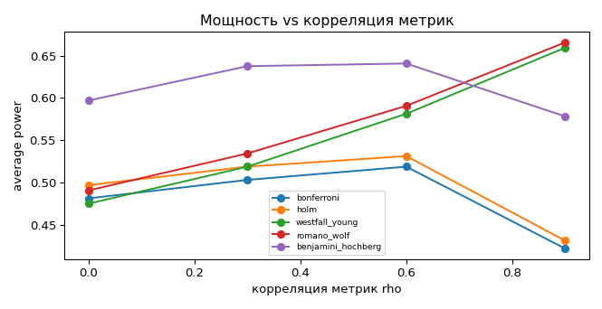
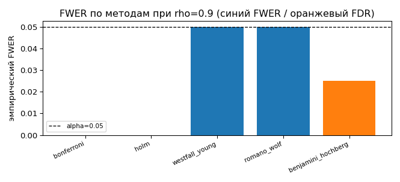

# R&D-8. Сравнение методов множественного тестирования (OR-регион)

> Статус: ✅ базовый эксперимент готов. Логика — в пакете `src/rnd_reports/multiple_testing/`
> (на готовых решениях scipy/statsmodels; своё — только Romano–Wolf stepdown), витрина —
> `notebook.ipynb`. Числа и фигуры — синтетика, seed=42/1.

## Цель

В A/B-пилоте с несколькими метриками вопрос начинается не с «какую поправку применить», а с
типа утверждения (claim). Цепочка: **метрики → роли → семейства гипотез → логика claim →
метод**. Этот RnD ограничен **OR-регионом**: есть заранее заданное семейство target-метрик,
и нас интересует «есть ли в нём хотя бы один надёжный сигнал и какие именно метрики его
дали». Ложный успех такого OR-claim — хотя бы одно ложное отвержение, поэтому контролируем
**FWER**. Задача RnD — честно сравнить методы OR-региона между собой.

## Данные и контракт

Таблица формата `id, treatment, target_1, ..., target_n`: `treatment` — бинарный индикатор
(0=control, 1=treatment), каждая числовая `target_*` — отдельная гипотеза о treatment effect
(разница средних). Контракт одинаков для синтетики и реальной таблицы; синтетика
(`make_ab_table`) дополнительно отдаёт известные `true_effects`, что позволяет мерить power и
FWER. Коррелированность метрик (параметр `rho`) — ключевой фактор различия методов.

## Методы

| Метод | Контроль ошибки | Опора | Идея |
|---|---|---|---|
| Bonferroni | FWER | statsmodels | порог α/m, union bound; прост, консервативен |
| Holm | FWER | statsmodels | stepdown по отсортированным p-value; не слабее Bonferroni |
| Westfall–Young (maxT) | FWER | scipy + перестановки | калибровка по распределению максимума абсолютных t семейства; учитывает корреляцию |
| Romano–Wolf (stepdown) | FWER | перестановки (своя реализация) | максимум абсолютных t по сужающемуся активному множеству; мощнее WY |
| Benjamini–Hochberg | FDR | scipy | единственный FDR-ориентир (exploratory-компаратор) |

Bonferroni/Holm используют только вектор raw p-value и игнорируют корреляцию метрик.
Westfall–Young и Romano–Wolf используют совместное распределение тестовых статистик
(перестановки treatment-лейблов) и потому выигрывают в мощности на коррелированных метриках
при том же контроле FWER. BH контролирует FDR — мощнее, но допускает больше ложных находок;
это компаратор для exploration, а не launch-процедура OR-claim.

## Дизайн сравнения

- **Single-table** (`run_comparison`) — adjusted p-value и решения всех методов на одной
  таблице. Работает и на своей реальной таблице (в ноутбуке — одна помеченная ячейка
  подмены); при известной правде добавляет TP/FP/realized-FDR/power.
- **Operating characteristics** (`operating_characteristics`) — Monte-Carlo: усреднение по
  многим симуляциям с известной правдой. По сетке корреляций `rho` считаем эмпирический FWER
  (доля симуляций с ≥1 ложным отвержением) и average power. Только так методы сравнимы честно
  — одна реализация таблицы для этого недостаточна.

## Результаты

**Single-table.** На сильных сигналах все методы согласованы; различие — на грани значимости,
где Romano–Wolf / Westfall–Young менее консервативны, чем Bonferroni/Holm, при том же контроле
FWER.

Детальнее по каждой метрике — эффект с доверительным интервалом (слева) и raw/adjusted p-value
по методам в лог-шкале с порогом α (справа): видно, как FWER-коррекция отодвигает p-value к
незначимости и какие метрики дают надёжный сигнал.

**Сравнение «через p-values».** Помимо reject-решений методы сравниваются скалярными
сводками из adjusted p-value (`res.pvalue_profile`): средний adjusted-p на истинно-ненулевых
метриках (`mean_p_adj_signal` — сила детекции), на нулевых (`mean_p_adj_null` — калибровка) и
зазор консервативности `conservativeness_gap` = среднее `p_adj − p_raw` (инфляция над raw;
единственная из трёх величин, считается и на реальной таблице, где правда неизвестна). Это
законная общая шкала для **FWER-методов**: их adjusted p-value отвечают на один вопрос
(«минимальный α, при котором метод отвергает гипотезу») и контролируют одну ошибку, поэтому
видно упорядочение по консервативности (Bonferroni ≥ Holm ≥ Westfall–Young ≥ Romano–Wolf).
Benjamini–Hochberg в той же таблице помечен `error_control = FDR`: его adjusted p-value — это
**q-value другой валюты ошибки** (ожидаемая доля ложных среди отвергнутых, а не вероятность
хоть одной ложной), поэтому его строку читаем отдельно и не усредняем с FWER-методами.

**Operating characteristics.** Главное различие видно на зависимости мощности от корреляции
метрик: power Westfall–Young / Romano–Wolf растёт с `rho` (≈0.49 при `rho`=0 → ≈0.66 при
`rho`=0.9), тогда как Bonferroni/Holm остаются плоскими (≈0.48 → ≈0.43) — они корреляцию не
используют.

При этом FWER всех четырёх FWER-методов держится у α=0.05, а Benjamini–Hochberg (FDR) даёт
более высокий уровень ложных находок — ожидаемая плата за бо́льшую мощность.

## Выводы

- Для **коррелированного** OR-семейства — Romano–Wolf / Westfall–Young (заметный выигрыш в
  мощности без потери контроля FWER).
- Для **малого простого** семейства — Holm/Bonferroni (почти та же мощность, проще объяснить
  и воспроизвести).
- Benjamini–Hochberg — для exploration (поиск кандидатов), не для launch-решения OR-claim.

## Вне scope этой версии

Из таблицы `id, treatment, target_*` без дополнительной конфигурации нельзя честно вывести
другие регионы пространства множественного тестирования (см. конспект-методологию):
**co-primary / intersection–union** (нужны обязательные условия успеха), **no-harm /
non-inferiority** (guardrail-метрики, направление вреда, margin), **gatekeeping / fixed
sequence** (порядок claims/families), **graphical procedures** (узлы, alpha-веса, routing),
**closed testing** (комбинаторный взрыв пересечений). Они требуют ролей метрик и decision-logic,
задаваемых вне таблицы. Бизнес-декомпозиция вклада (effect sizes, CI, OEC) — отдельная задача,
которую p-value не закрывают.
